# Online-shop-for-electronics (Capstone Project)

Title :- N.I.S.E. COMP.

The project is to build for the HTML & CSS Capstone Project is based on an online shop for electronics. But I have  personalised the content, i.e., instead of a shop of electronics I have created an studying website "N.I.S.E. Comp". It is an website where contents can be bought through digital means, and knowledge can be shared digitally.

#Homepage

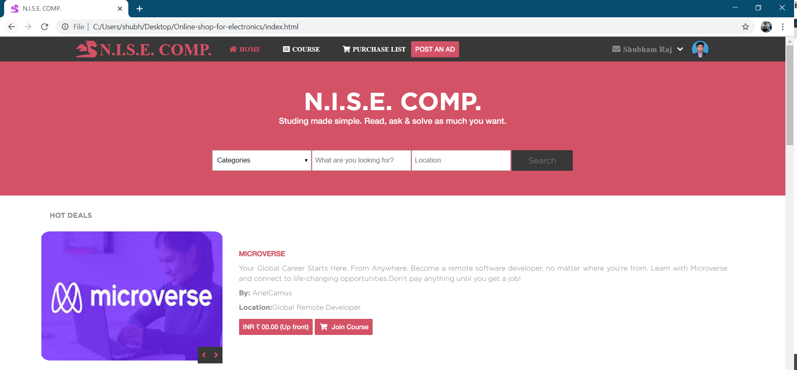

#Category

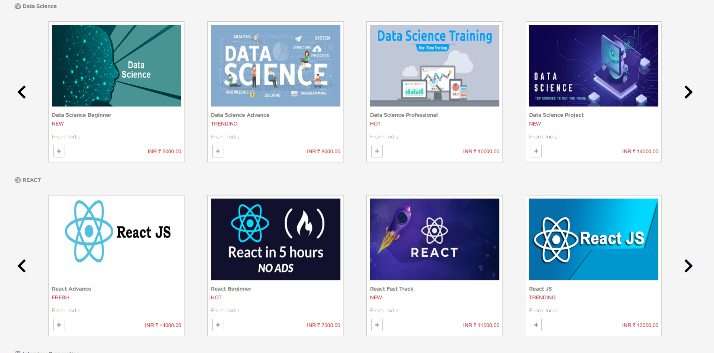

#Search Bar in Mobile View

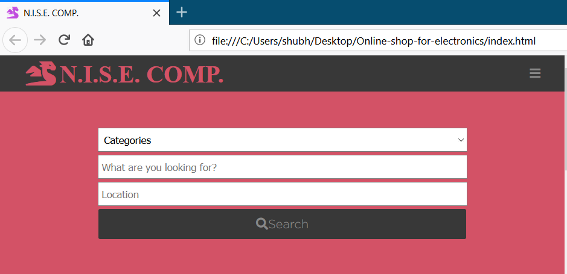

#Various Products Breakpoints

#4 Grid View

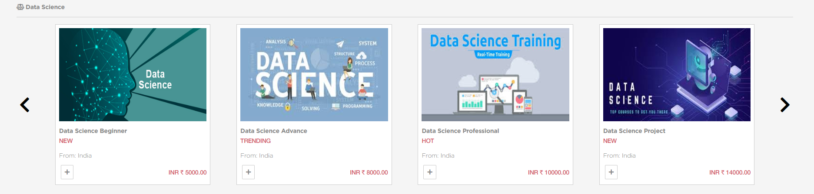

#3 Grid View

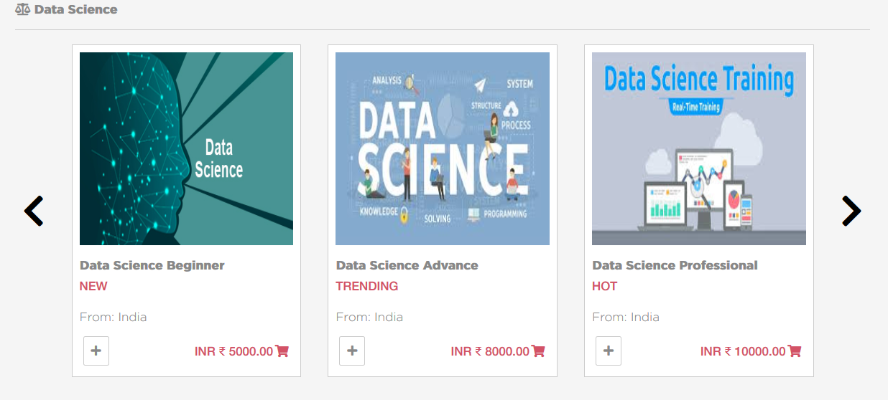

#2 Grid View

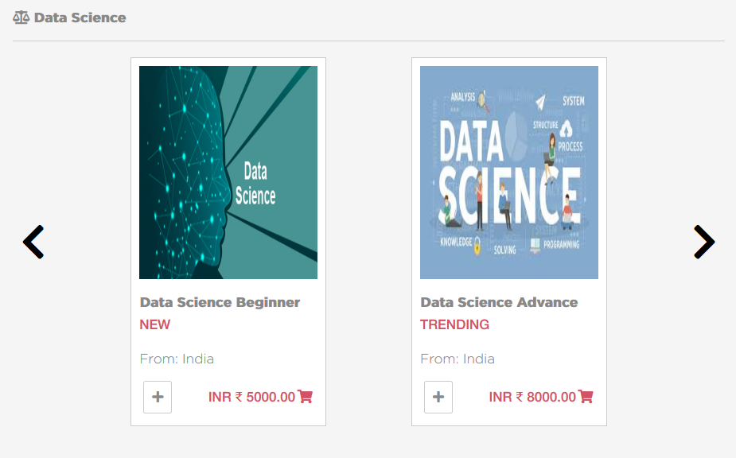

#Footer

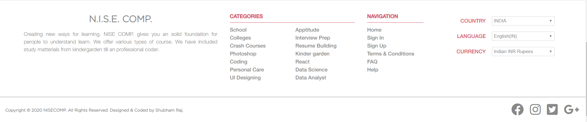

#SearchPage

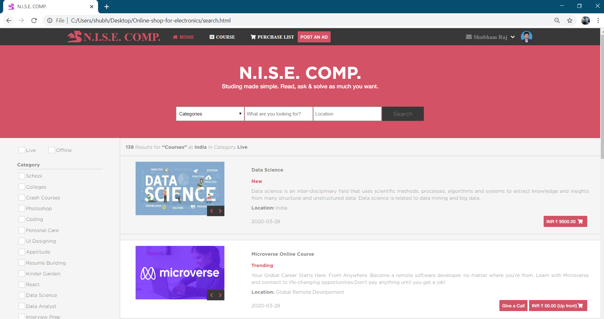
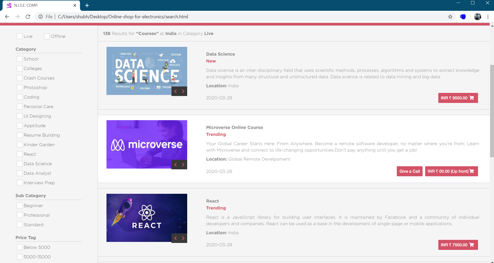

#Products
1. Product 1 - Data Science

2. Product 2 - React

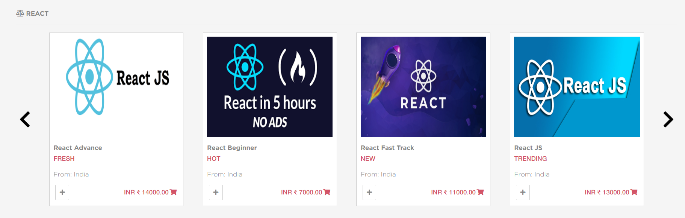

3. Product 3 - Interview Preperation

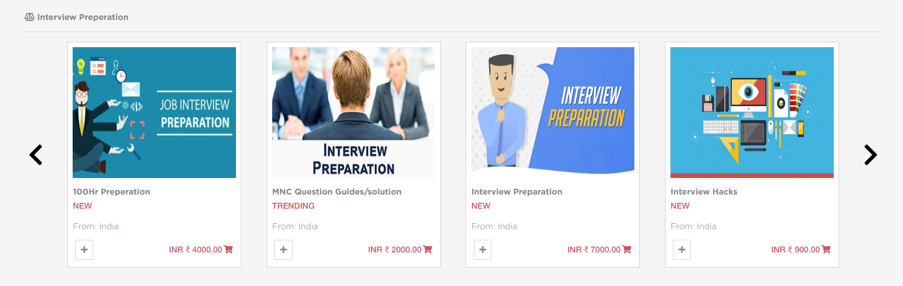

4. Product 4 - Ruby

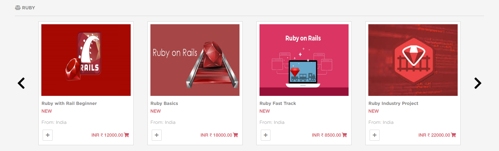

Additional description about the project and its features.

## Built With

- ATOM,
- HTML,
- CSS
- Bootstrap

## Live Demo

[Live Demo Link](https://shubham14p3.github.io/Online-shop-for-electronics/)

## Description

The minimum requirements:
- the main page (search page), with a link to the results page
- the search results page

Each of these pages have 2 different version for screen sizes:
- Mobile: up to 768px
- Tablet & Desktop: from 768px

Guidelines that were followed for the given design, including:
- Colors
- Typographies: font face, size and weight
- Layout: composition and space between elements, for the 2 given screen sizes

To get a local copy up and running follow these simple example steps.

git clone https://github.com/shubham14p3/Online-shop-for-electronics.git

## General Page Structure

The overall page contains the following sections:
- Navbar
- Key Columns: columns that organize information with category responding to specific media sizes.
- Different Products for every category
- Featured Slideshow
- Footer

## Authors

👤 **Shubham Raj**

- Github: [@shubham14p3](https://github.com/shubham14p3)
- Linkedin: [shubham14p3](https://linkedin.com/shubham14p3)

## 🤝 Contributing

Contributions, issues and feature requests are welcome!

Feel free to check the [issues page](https://github.com/shubham14p3/Online-shop-for-electronics/issues/).

## Show your support

Give a ⭐️ if you like this project!

## Acknowledgments

- @Microverse
- My family

## 📝 License

This project is [MIT](lic.url) licensed.
